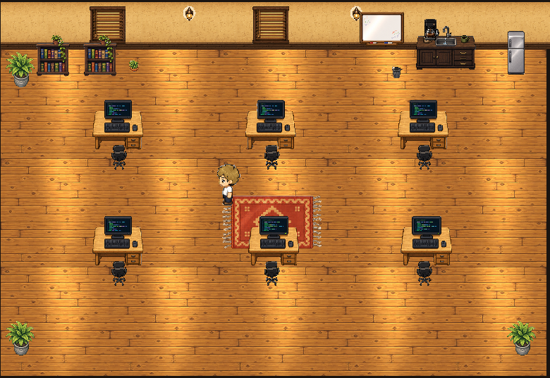
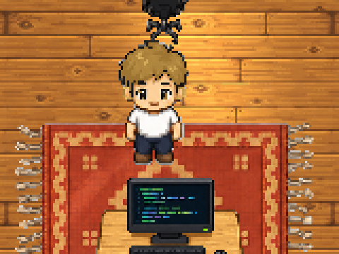
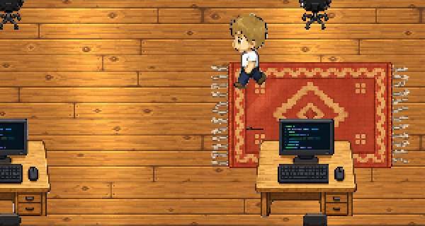

# rpg-maker

RPG Maker 概念的 2D 房間引擎:場景由「獨立模組化素材」以 JSON 資料拼裝而成,每一張素材都是連續幀動畫(沒有靜止圖),角色走紙娃娃分層系統。



## 特色

- **場景即資料**:房間定義在 `assets/scenes/office.json`,移動冰箱 / 窗戶 / 桌子 = 改一行 JSON 座標,不用重畫任何圖。
- **全素材動畫化**:地板木紋光影、百葉窗、螢幕代碼捲動、咖啡機蒸氣、盆栽搖曳……每個素材都是 sprite sheet 連續幀(家具 2×2、角色 4×4)。
- **紙娃娃角色**:身體 / 髮型分層疊加,WASD / 方向鍵移動、牆與家具碰撞、站立有呼吸 idle 動畫。髮色由 `tools/make-hair-overlay.py` 從 body sheet 程式化換色生成(blonde / pink / silver),逐像素天生對齊。
- **y-sort 遮擋**:角色走到桌子後面會被正確遮住;`flat`(地毯)與 `z` 覆寫(檯面小物)另有排序規則。
- **素材管線**:`tools/gen-queue.sh` 走 codex CLI 依 `assets/prompts/*.txt` 生圖、自動去背、落地 `assets/raw/`,單一序列 queue 不吃爆資源。

| 站立(呼吸) | 走路(紙娃娃髮層) |
|---|---|
|  |  |

## 快速開始

```bash
npm install
npm run dev        # http://localhost:5173/         → office 場景 + 可操作角色
                   # http://localhost:5173/#preview → 全素材動畫預覽格
```

操作:WASD / 方向鍵移動。

## 架構

- `src/scene.ts` — 讀場景 JSON,鋪地板 / 牆、擺物件、建碰撞箱、y-sort
- `src/player.ts` — 紙娃娃角色(多層 AnimatedSprite 疊加、四向 walk/idle、碰撞滑牆)
- `src/assets.ts` — manifest 載入、sheet 切幀
- `assets/manifest.json` — 素材註冊表(sheet 路徑、格數、fps、錨點、縮放、碰撞箱)
- `assets/scenes/office.json` — 房間定義(尺寸、地板 / 牆素材、物件清單、出生點)

技術棧:PixiJS v8 + Vite + TypeScript。
