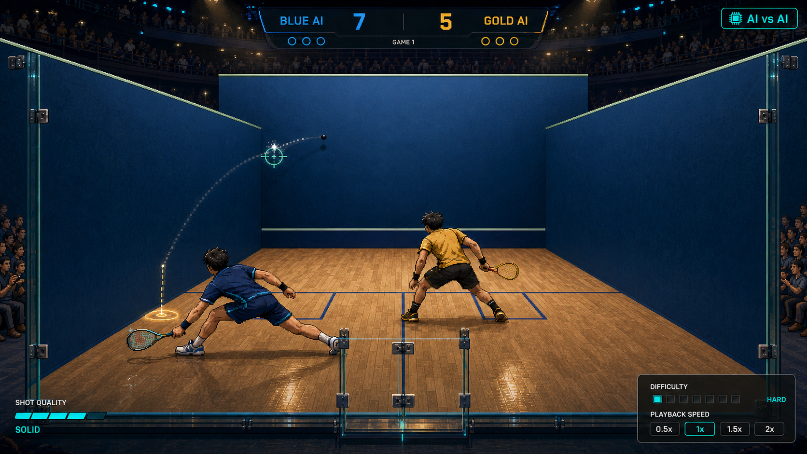
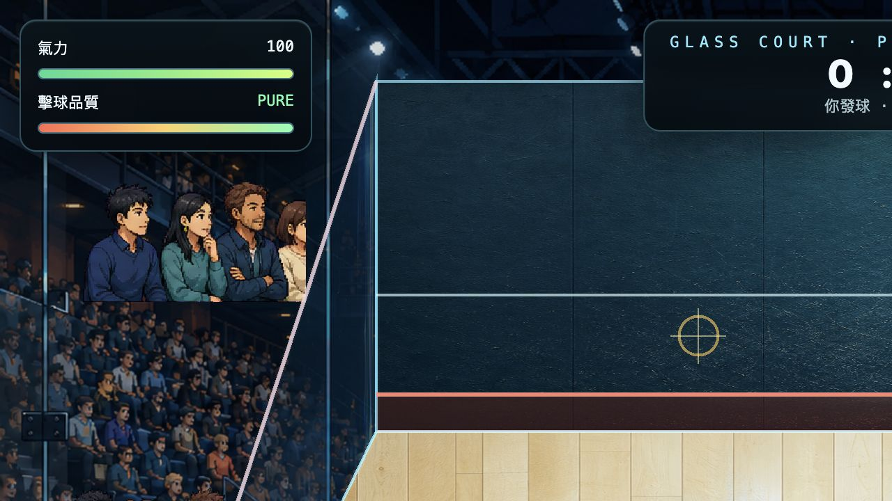
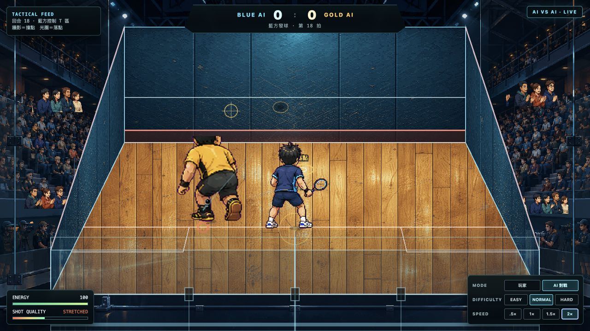
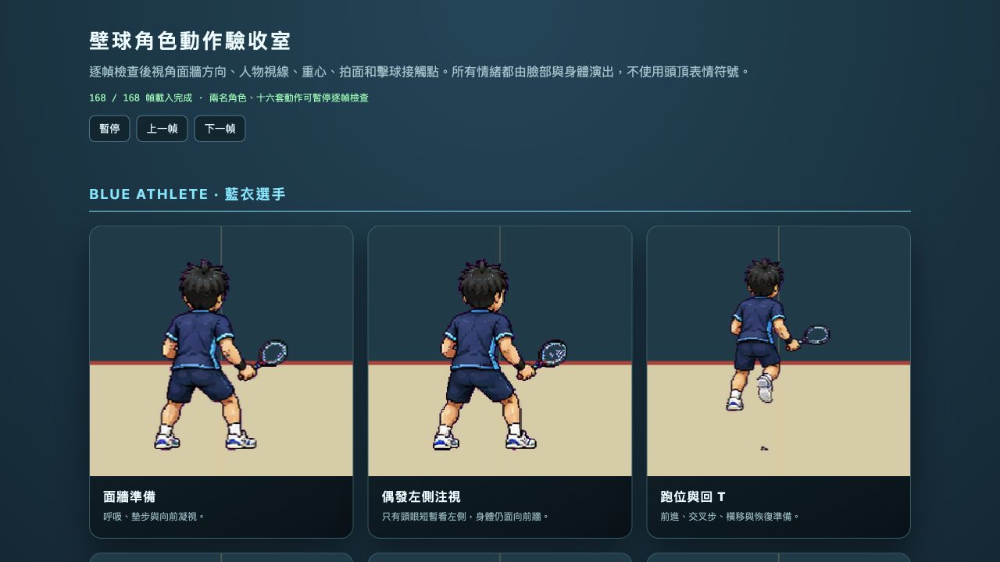
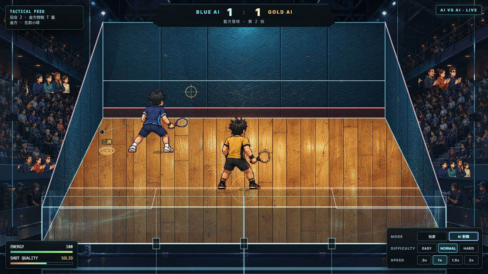

# 《玻璃禁區》畫面方向與製作紀錄

## 旗艦畫面基準

這張概念圖鎖定三個不能妥協的視覺條件：

1. 鏡頭位於後玻璃外，玻璃門片、直柱、金屬扣件、反光和觀眾倒影都必須可讀。
2. 牆面、地板、人物與觀眾使用同一套高色階像素美術語言，不混入寫實照片感。
3. 左牆要有厚度、板縫、磨損和透視；楓木地板要有板材差異、刮痕、光澤和向前牆收束的透視。

HUD 只負責轉播資訊，不遮住球場。比分置中、戰術資料貼邊，雙 AI 模式、難度和速度集中在右下角。

## 元素拆解與重組

概念圖不直接作為遊戲背景。最終畫面由可獨立替換、縮放、遮罩與動畫的元素重新組成：

| 概念元素 | 遊戲實作 |
|---|---|
| 場館與觀眾 | 場館全景圖加四組錯相觀眾動畫，得分時切換歡呼動作 |
| 前牆 | 獨立像素牆板圖，透視遮罩後加 service line、tin 與撞點影子 |
| 左右側牆 | 同材質的兩面實體牆，各有連接前後牆高度的單一斜向 out-line |
| 楓木地板 | 獨立像素木板圖，另畫官方 short-line、half-court line 和兩個對稱 1.6m 發球框 |
| 後玻璃 | 反射圖、五片門板、中央門、直柱、金屬扣件、底軌與週期掃光分層 |
| 藍衣／黃衣選手 | 六張獨立 sprite sheet，共 168 幀，不以 tint 共用人物 |
| 球路資訊 | 動態球、尾跡、下一次牆面撞點影子與下一次地板落點 |
| 轉播 HUD | 置中比分、左上戰術 feed、左下品質／體力、右下模式／難度／速度 |

場地比例依 World Squash 單打規格：9.75m × 6.4m、前牆出界線 4.57m、後牆出界線 2.13m、short-line 距後牆 4.26m、兩個發球框內徑 1.6m。左右牆只有一條連接前後牆出界高度的斜線；地板只有兩個對稱發球框，不存在右側額外方框。

## 改版前的實機問題

- 高 DPI 解析度被重複套用，1280×720 畫面只顯示了設計稿的左半邊。
- 分數與狀態面板過大，遮住球場；角色、後場與地板甚至沒有進入可視範圍。
- 左牆被當成玻璃反射色塊，沒有實體牆面材質。
- 楓木地板與牆面偏寫實照片，跟像素人物不屬於同一個美術系統。
- 動態觀眾比例太大，像貼在畫面上的人物群，而不是場館的一部分。

## 改版後的實機結果

- 修正 Pixi 高 DPI 縮放，完整呈現前牆、左右牆、整片地板與後玻璃。
- 重製像素風前牆、兩面側牆與楓木地板圖像，再用透視遮罩分層貼合。
- 後玻璃新增獨立反射圖層、五片門板、金屬扣件、底軌與週期掃光。
- 角色重畫為藍衣與黃衣兩名獨立選手，共 168 幀後視角動作與眼神演出。
- HUD 改為轉播式貼邊配置，球場保持主體；支援玩家對 AI 與 AI 對 AI。

## 雙 AI 對戰

觀戰模式不是腳本播放。兩名 AI 分別執行：

- 自動發球與接發球。
- 預測球的攔截點並回到 T 區。
- 依對手位置選擇平抽、小球、高吊或側牆球。
- 依擊球距離、高度、體力與勉強救球狀態產生品質。
- 正常套用前牆、側牆、後玻璃、一次落地與第二次落地判分。

難度會改變移動速度、可及範圍、反應時間、預測誤差與瞄準散布；觀戰速度會同步縮放物理、計時器、碰球幀與人物動畫。

### 位置棋局

每次接球會建立直線壓深、交叉加速、左右前場小球、左右後場高吊與側牆變線等 8 個候選解。系統先以真實球體碰撞預演第一次落點，再比較對手到落點的距離、自己回 T 的成本、角落壓力、安全性、比分、回合長度以及最近使用過的球路。勉強接球時安全球權重提高；對手落在後場時小球升值；對手壓到前場時高吊升值；長回合則提高變線與終結意圖。

實機第二輪以 Normal、1× 跑 40 秒，戰術 feed 觀察到 12 種不同結果，包含左右小球、左右高吊、交叉加速、側牆變線與被動重整；最高連續 47 拍並正常完成第一分，console error 為 0。

## 完整實機錄影

[`squash-ai-duel-full-match.mp4`](../../assets/concepts/squash-ai-duel-full-match.mp4) 是一次未預演的完整 AI 對戰。比賽以 Easy、2× 進行，金方中段曾以 7:5 領先，藍方最後以 11:9 逆轉勝出。影片保留完整 HUD、落點、撞牆影、玻璃反光、觀眾動作與勝出畫面。

## 驗收方式

瀏覽器實際切換到「AI 對戰」、速度 2×，讓比賽自動進行。判分驗收先看到 24 拍連續回合，之後金方因第二次落地取得 1 分並自動接續發球，畫面與 DOM 比分同步顯示 `BLUE AI 0 : 1 GOLD AI`。最後素材版再跑到第 51 拍並截取上方實機圖；角色驗收室顯示 `168 / 168` 幀載入完成，兩個頁面的 console error 都是 0。
